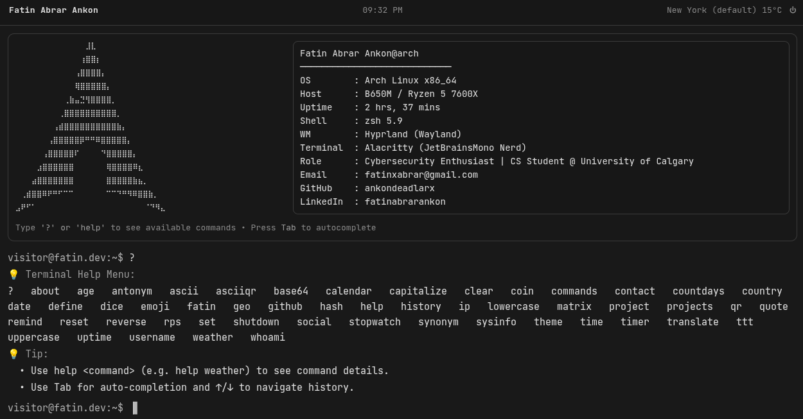

# 🖥️ Terminal Portfolio

A modern, interactive terminal-style personal portfolio built with **Next.js**, **TypeScript**, and **Tailwind CSS**. Browse projects, check contact info, and explore a fully functional terminal experience directly in your browser.

**Live Demo**: [terminal-portfolio.vercel.app](https://terminal-portfolio.vercel.app)  
**Author**: [Fatin Abrar Ankon](https://github.com/ankondeadlarx)

## 📸 Screenshot



---

## ✨ Features

- **Interactive Terminal Interface** — Type commands like in a real terminal
- **Live Command Suggestions** — Auto-complete as you type
- **Project Portfolio** — Showcase your work with detailed project information
- **Multiple Themes** — 10 curated color themes (Ash, Dracula, Gruvbox, Tokyo, Ubuntu, etc.)
- **API Integrations** — Real-time weather, GitHub user lookup, word definitions, translations
- **Fully Responsive** — Works on desktop and mobile
- **Dark Mode Ready** — Eye-friendly ash theme by default
- **Command History** — Track commands with arrow-key navigation
- **Persistent Storage** — Theme and username saved to localStorage

---

## 🛠️ Tech Stack

- **Frontend**: React 19, TypeScript, Next.js 16 (App Router, Turbopack)
- **Styling**: Tailwind CSS 4
- **API Integration**: Fetch API (Next.js API routes)
- **Database**: LocalStorage (client-side persistence)
- **Deployment**: Vercel
- **Build Tools**: ESLint, npm

---

## 📋 Available Commands

- `help` — Show all commands with descriptions
- `about` / `me` — Display portfolio owner's profile
- `projects` — View project highlights
- `project <1-3>` — Show full details for a single project
- `contact` — Display contact information
- `social` — Show social media profiles
- `github <username>` — Fetch GitHub user info and top repos
- `weather [city]` — Get current weather using geolocation or city name
- `define <word>` — Look up word definitions
- `theme [name]` — List themes or change current theme
- `date` / `time` / `uptime` — System info
- `whoami` / `sysinfo` — Browser and system details
- Plus 30+ more utility commands (calculator, translator, QR codes, ASCII art, games, etc.)

---

## 🚀 Quick Start

### Prerequisites
- Node.js 18+ and npm

### Installation

```bash
# Clone the repository
git clone https://github.com/ankondeadlarx/terminal-portfolio.git
cd terminal-portfolio/terminal-app

# Install dependencies
npm install

# Run development server
npm run dev
```

Open [http://localhost:3000](http://localhost:3000) and start typing commands.

---

## 🎨 Customization

Edit `lib/profile.ts` to personalize your portfolio:

```typescript
export const OWNER = {
  name:     "Your Name",
  email:    "your.email@example.com",
  github:   "https://github.com/yourname",
  linkedin: "https://linkedin.com/in/yourname",
  // ... add more fields
};

export const PROJECTS = [
  {
    name:  "Project Title",
    desc:  "Project description",
    stack: "Tech, Stack, Here",
    url:   "https://github.com/...",
  },
  // Add more projects
];
```

---

## 📦 Build & Deploy

### Local Build
```bash
npm run build
npm run lint
```

### Deploy on Vercel (Recommended)

See [Deployment Guide](#vercel-deployment-guide) below.

---

## 🌐 Vercel Deployment Guide

### Step-by-Step

1. **Go to Vercel**
   - Visit [vercel.com](https://vercel.com)
   - Sign in or create a free account (GitHub login recommended)

2. **Import Your GitHub Repository**
   - Click "Add New Project"
   - Select "Import Git Repository"
   - Search for `terminal-portfolio`
   - Click "Import"

3. **Configure Project**
   - Framework: **Next.js** (auto-detected)
   - Root Directory: `terminal-app` (if your repo has a parent folder)
   - Build Command: `npm run build` (default)
   - Output Directory: `.next` (default)
   - Leave environment variables blank (unless you add them later)

4. **Deploy**
   - Click "Deploy"
   - Wait 1-2 minutes for build to complete
   - Your live URL will appear: `your-project.vercel.app`

5. **Custom Domain (Optional)**
   - In Vercel dashboard, go to **Settings → Domains**
   - Add your custom domain
   - Follow DNS setup instructions from your domain registrar

6. **Automatic Redeploys**
   - Every push to `main` branch automatically redeploys
   - Staging previews available for pull requests

---

## 📁 Project Structure

```
terminal-app/
├── app/
│   ├── page.tsx          # Main terminal interface
│   ├── layout.tsx        # Root layout
│   ├── globals.css       # Themes and styling
│   └── api/              # Next.js API routes (weather, github, define, etc.)
├── components/
│   ├── Terminal.tsx      # Terminal logic and state
│   ├── Banner.tsx        # Hero section with Arch logo
│   ├── Header.tsx        # Top bar with time and controls
│   └── Footer.tsx        # Time display
├── lib/
│   ├── profile.ts        # Owner data and projects
│   ├── commands.ts       # Command handlers
│   ├── commands-meta.ts  # Command metadata (help, usage)
│   ├── storage.ts        # localStorage utilities
│   └── types.ts          # TypeScript types
├── public/               # Static assets
├── package.json
└── tsconfig.json
```

---

## 🔧 Development

### Run Tests/Lint
```bash
npm run lint
npm run build   # Type check included
```

### Hot Reload
Development server auto-reloads on file changes.

### Add New Commands
1. Define command in `lib/commands-meta.ts`
2. Add handler logic in `lib/commands.ts` (in the switch statement)
3. Add to `COMMANDS` export if it's a new category

---

## 📝 License

This project is open source and available under the MIT License.

---

## 👋 Connect

- **GitHub**: [@ankondeadlarx](https://github.com/ankondeadlarx)
- **LinkedIn**: [Fatin Abrar Ankon](https://linkedin.com/in/fatinabrarankon)
- **Email**: fatinxabrar@gmail.com

---

## 🙋 Support

Found a bug or have a feature request? Open an [issue on GitHub](https://github.com/ankondeadlarx/terminal-portfolio/issues).

---

**Built with ❤️ using Next.js**
